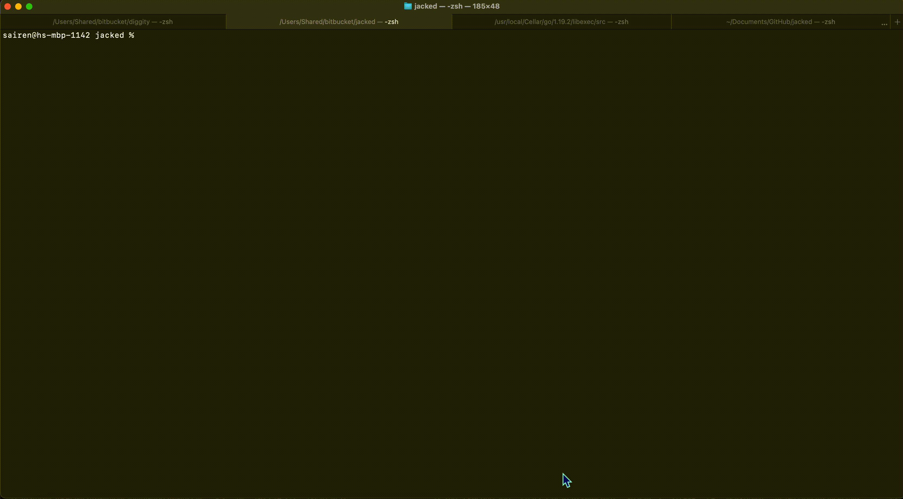

<p align="center">

</p>

# Jacked

A CLI tool and Go library for scanning image vulnerability. Partner with [Diggity](https://github.com/carbonetes/diggity) for generating a Software Bill of Materials (SBOM) from container images and filesystems .

# Features
- 🐞 | Scans image vulnerability, check if your image is at risks.
- 🔧 | Configuration that helps user's preference using the tool.
- ⛑ | Works with major operating system and many packages.
- 🗃 | Works seamlessly with [Diggity](https://github.com/carbonetes/diggity) (SBOM Container Image and File System)
- 🗄 | Convert results to JSON and Tabulated Format.


# Installation 📥
## Recommended

Install a great way to install a working binary tool to your terminal. 
```bash
curl -sSfL https://raw.githubusercontent.com/jaii041715/jacked/main/install.sh | sh -s -- -d /usr/local/bin
```
## Build 🏗

Go programming language together with the clone repository is needed to run the CLI tool.
```bash
$ git clone https://github.com/carbonetes/jacked
$ go install .
```


## Choosing another destination path & Install Previous Version 🎲
you can specify a release version and destination directory for the installation:

```
curl -sSfL https://raw.githubusercontent.com/carbonetes/diggity/main/install.sh | sh -s -- -d <DESTINATION_DIR> -v <RELEASE_VERSION>
```

<details>
<summary>Here's a sample installation and running the CLI tool.</summary>

</details>

# Getting Started 🚀  

## Run the CLI tool 🏁
Once you've successfully installed the Jacked and wanted to scan an image. On your terminal:
```
jacked -i <image>
```

## Output formats

The output format for Diggity is configurable as well using the
`-o` (or `--output`) option:

Where the `formats` available are:
- `table`: A columnar summary (default).
- `json`: Use this to get as much information out of Jacked.
## Useful Commands and Flags 🚩
```
jacked [command] [flags]
```
### Available Commands and their flags with description:
Legend:
- Command
  - flag
    - description

- config
  - --disable-license
    - Disable license finder by default.
  - --disable-quiet
    - Disable quiet mode by default.
  - --disable-secret
    - Disable secret by default.
  - --enable-license
    - Enable license finder by default.
  - --enable-quiet
    - Enable quiet mode by default.
  - --enable-secret
    - Enable secret by default.
  - --get-path
    - Show configuration file path.
  - --list
    - List all available configurations.
  - --reset-default
    - Reset configurations to default values.
  - --set-output string
    - Set default output format (json or table).
- db
  - -i
  - --info
    - Print database metadata information.
  - -v
  - --version
    - Print database current version.
- version
  - -o [string]
  - --output [string]
    - format to display results ([text, json]) (default "text")

## Configuration 🚧
Improve using the tool under your preferences.
<br>
Configuration search paths:
- `<HOME>/.jacked.yaml`

Configuration options (example values are the default):

```yaml
settings:
  output: table
  quiet: false
  license: false
  secret: false
ignore:
  vulnerability:
    cve: []
    package: []
    vendor: []
    severity: []
  package:
    name: []
    type: []
    version: []
```

## License

[Apache 2.0](https://choosealicense.com/licenses/mit/)
